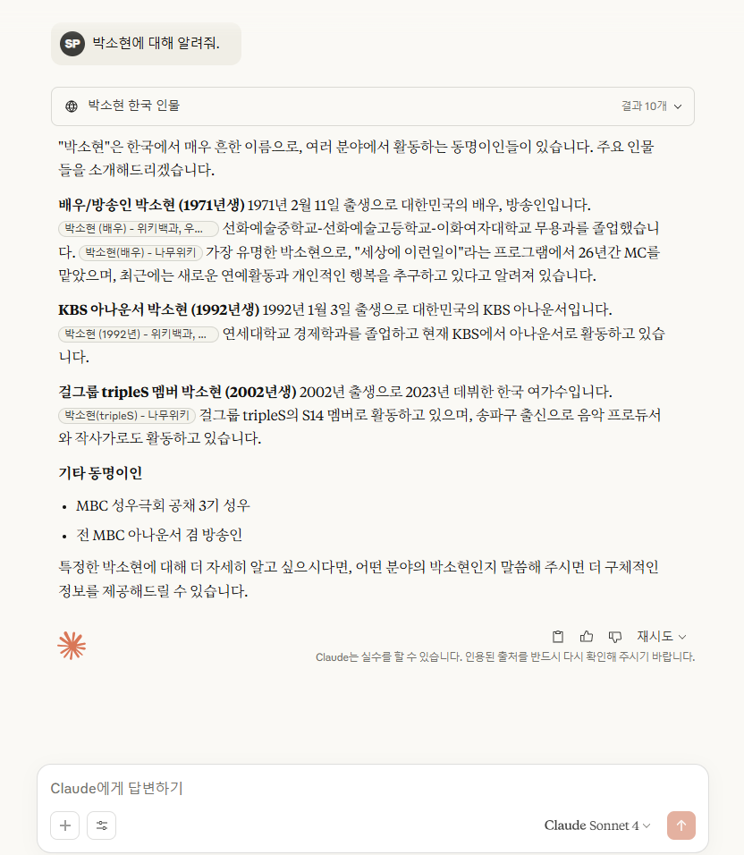
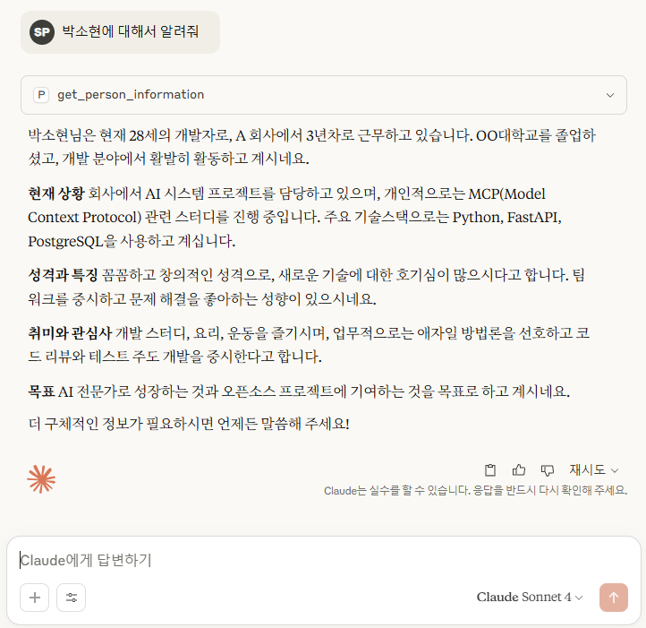

# Personal Info MCP Server

Claude Desktop에서 개인 정보를 조회할 수 있는 MCP Server 프로젝트

## 기능
- "OOO에 대해 알려줘"와 같은 질문으로 개인 정보 조회
- JSON 기반 데이터 저장
- 자연어로 정보 제공

## 프로젝트 구조
```
mcpstudy/
├── mcp_server/
│   ├── personal_info_server.py    # MCP Server 메인 코드
│   └── requirements.txt           # 필요한 패키지
├── data/
│   ├── person_info.json          # 개인 정보 데이터
│   └── README.md                  # 데이터 설명
├── config/
│   └── claude_desktop_config.json # Claude Desktop 설정
└── README.md                      # 프로젝트 설명
```

## 사용 방법
1. 필요한 패키지 설치: `pip install -r mcp_server/requirements.txt`
2. Claude Desktop 설정 파일 업데이트
3. Claude Desktop 재시작
4. "OOO에 대해 알려줘" 질문하기

## 배치 파일
배치 파일을 통해 가상환경 활성화 과정을 자동화 (run_mcp_server.bat)

## 테스트 질문 예시
- "OOO에 대해 알려줘"
- "OOO의 취미는 뭐야?"
- "OOO의 직업은?"

## 결과


### After (MCP 연결 후)
